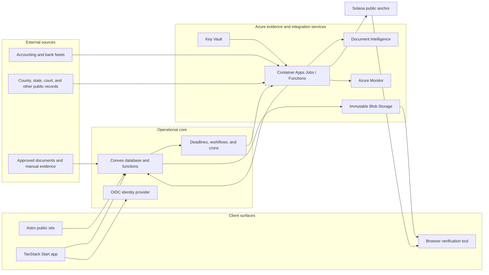

# TieCamel: Nonprofit Governance, Transparency, and Technical Roadmap

> Product name: **TieCamel**  
> Repository: `tiecamel`  
> Last updated: July 19, 2026  
> Intended audience: nonprofit leaders, board members, nonprofit members and donors, prospective design partners, and product and engineering teams

## Executive summary

TieCamel is a governance, compliance, and financial-transparency platform for nonprofit organizations, including faith-based institutions, community centers, charities, foundations, schools, associations, and other member- or donor-supported organizations.

Its purpose is to make it difficult for a material obligation or risk to remain known only to one officer. It combines:

- A register of properties, filings, loans, insurance policies, exemptions, lawsuits, and other material obligations.
- Deadline ownership, evidence requirements, independent review, and automatic escalation.
- Board decisions, votes, action items, and attestations with a durable audit trail.
- Tiered financial reporting for finance staff, directors, verified members, and the public.
- Independent public-record and data-source monitoring where reliable sources are available.
- Cryptographic verification and optional Solana anchoring so published reports cannot be silently rewritten later.

The product is not a replacement for accountants, attorneys, QuickBooks, a bank, or an organization's bylaws. It is an oversight and evidence layer above those systems.

The recommended initial rollout is a 90-day design-partner pilot with one nonprofit that has material financial, compliance, funding, or asset-management obligations, focused on four outcomes:

1. Establish one authoritative view of the organization's material obligations and their status.
2. Give the full board timely visibility into deadlines, risks, and unresolved decisions.
3. Publish a consistent member-facing financial and governance report without exposing privileged or private information.
4. Prove that each published report is complete for its stated scope and has not been altered after publication.

## The pitch in one sentence

> TieCamel helps nonprofit organizations prove that critical obligations are being handled—and automatically alerts the right people when they are not.

## Why this product should exist

Most nonprofit software solves one narrow problem:

- Accounting software records financial activity.
- Board portals organize meetings and documents.
- Compliance calendars remind someone about a filing.
- Donation platforms show how campaigns are funded.
- Public charity databases show delayed annual disclosures.

The dangerous gap is between these systems. An accountant may know that a tax remains unpaid, a board officer may receive an official notice, a lawyer may know about a deadline, and community members may assume everything is fine. None of the existing systems necessarily ensures that the full board sees the same risk, that a decision is documented, or that the issue escalates when it remains unresolved.

TieCamel closes that gap by connecting evidence, responsibility, escalation, and disclosure.

## Origin case study: when a missed obligation becomes an existential risk

A recent Illinois faith-based nonprofit property-tax matter is one example that motivated the product, but TieCamel is not specific to a particular organization, nonprofit sector, or type of obligation. It should not attempt to decide who was personally responsible for that matter. That requires a complete factual record and legal analysis. TieCamel instead addresses the observable control failures that can place any nonprofit organization at risk:

- Property-tax exemption status was consequential but apparently not broadly understood.
- The difference between an application, a pending application, and a formally approved exemption was material.
- Tax bills, penalties, a tax sale, a tax-deed petition, and a redemption deadline created multiple escalation opportunities.
- Professional advice and the board's response to it may not have been visible or formally recorded.
- Community members lacked timely financial, legal-cost, and governance information.
- Once the matter became public, verified facts, organizational statements, professional opinions, and allegations were mixed together.

The same control pattern can apply to a missed grant report, insurance renewal, state charity registration, payroll-tax payment, loan covenant, professional license, safeguarding requirement, or contractual deadline.

TieCamel is designed to make each of those categories visible, attributable, and difficult to suppress.

## Product principles

### 1. Prevention before postmortem

The most important output is not an attractive annual report. It is a warning delivered early enough to change the outcome.

### 2. No single point of silence

Material risks must escalate beyond the person responsible for resolving them. The original owner cannot unilaterally close a critical incident.

### 3. Evidence, not self-certification

"Complete" means that required evidence exists and, for high-risk obligations, a second qualified person has reviewed it.

### 4. Transparency with privacy

Members deserve meaningful information. They do not need donor identities, bank credentials, privileged legal strategy, employee records, or sensitive security details.

### 5. Provenance on every claim

Every material statement is labeled as one of:

- Verified from an official or bank-connected source.
- Reported by the organization.
- Attested by a named professional or reviewer.
- Submitted by a member and pending verification.
- Disputed, with each party's response preserved.

### 6. Corrections are appended, not erased

Published records can be corrected, but the original, the correction, the reason, and the approving parties remain visible.

### 7. Governance powers come from governing documents

The platform can execute a petition, special-meeting, election, or no-confidence workflow only when the organization's articles, bylaws, policies, and applicable law authorize it.

### 8. Blockchain is infrastructure, not the product

No user should need a wallet, token, NFT, or cryptocurrency balance. Solana is used only where a public timestamp and tamper-evident commitment add value.

## What TieCamel is—and is not

| TieCamel is | TieCamel is not |
| --- | --- |
| An oversight and escalation system | A substitute for legal or tax advice |
| A source-labeled evidence register | A place for anonymous public accusations |
| A board and member reporting layer | A general ledger or bookkeeping replacement |
| A tamper-evident publication system | A guarantee that submitted information is truthful or complete |
| A workflow engine governed by bylaws and policy | A mechanism for crowdsourcing daily management decisions |
| A read-only integration layer for financial systems | A cryptocurrency treasury |

## Primary users

### Board director

Needs a concise view of material risk, upcoming decisions, evidence, dissent, and unresolved action items. Must be able to demonstrate that they reviewed critical matters.

### President or executive director

Needs operational ownership, clear delegation, and a way to show that obligations are being handled without manually assembling reports.

### Treasurer and finance committee

Need exact financial data, restricted-fund status, reconciliations, budgets, debt, legal costs, and reporting workflows.

### Compliance owner

Needs deadlines, source documents, recurring obligations, reminder rules, and escalation paths.

### Independent reviewer

An accountant, attorney, governance professional, or trusted committee member who can review evidence and attest to a limited question without being given unrestricted access to everything.

### Verified member

Needs understandable financial and governance information, the ability to ask structured questions, and visibility into how material concerns are handled.

### Public visitor or donor

Needs a trustworthy summary of leadership, financial stewardship, current material risks, publication history, and data freshness.

### Platform administrator

Needs tenant support and security tooling but should not have routine access to customer documents. Exceptional access must be time-limited, approved, and audited.

## Information-access model

| Information | Finance team | Full board | Independent reviewer | Verified members | Public |
| --- | ---: | ---: | ---: | ---: | ---: |
| Individual bank transactions | Yes | Configurable | Scoped | No | No |
| Donor identities | Restricted | Normally no | No | No | No |
| Monthly financial statements | Yes | Yes | Yes | Summary | Annual or quarterly summary |
| Restricted-fund balances | Yes | Yes | Yes | Summary | Aggregate |
| Legal invoices | Yes | Yes | Scoped | Aggregate fees | Aggregate fees |
| Privileged legal strategy | No, unless authorized | Scoped | Counsel only | No | No |
| Material incident status | Yes | Yes | Yes | Yes | Configurable summary |
| Board votes and rationale | Yes | Yes | Yes | Non-confidential items | Published items |
| Member allegations | Triage only | Triage only | If assigned | Submitter and authorized reviewers | No, until verified and approved |
| Publication proofs | Yes | Yes | Yes | Yes | Yes |

## Core product workflows

### Organization onboarding

1. Verify the organization's legal identity.
2. Upload articles, bylaws, policies, board roster, and committee structure.
3. Identify properties, bank and accounting systems, loans, insurers, licenses, and professional advisors.
4. Adopt or configure the Transparency Covenant.
5. Assign responsibility and backup ownership for each obligation.
6. Define materiality thresholds and escalation recipients.
7. Configure member eligibility and publication tiers.
8. Produce an initial risk and data-completeness report.

### Obligation lifecycle

An obligation moves through a controlled state machine:

```text
Draft -> Active -> Due Soon -> At Risk -> Breached -> Resolved
                    |             |          |
                    +-> Disputed -+----------+
```

Every obligation includes:

- Authoritative source and jurisdiction.
- Responsible owner and backup owner.
- Due date and recurrence rule.
- Evidence required to close it.
- Financial or operational exposure.
- Escalation policy.
- Reviewer requirements.
- Disclosure classification.
- Complete chronological event history.

### Material incident workflow

1. Incident is created manually or by a monitored source.
2. The system records who knew what and when.
3. Responsible parties acknowledge the incident.
4. The board receives an initial impact and response summary.
5. A response deadline begins.
6. Failure to respond escalates to the next independent layer.
7. Member or public disclosure occurs according to the Transparency Covenant.
8. Resolution requires evidence, reviewer approval, and a post-incident action plan.

### Board decision workflow

1. Decision request states the question, deadline, alternatives, supporting evidence, risks, and conflicts.
2. Directors acknowledge receipt.
3. Discussion and professional advice are attached or referenced.
4. Vote, abstentions, recusals, and dissent are recorded.
5. The decision produces assigned follow-up actions.
6. Material decisions are included in the next cryptographically anchored report.

### Financial close and publication

1. Import accounting or bank data in read-only mode.
2. Reconcile the reporting period.
3. Generate board and member reporting views.
4. Treasurer attests to preparation and scope.
5. Reviewer attests to the checks they actually performed.
6. Board approves publication where required.
7. Generate a canonical report bundle and Merkle root.
8. Anchor the root on Solana.
9. Publish the report, verification proof, freshness date, and any limitations.

### Structured member question

1. A verified member submits a question under a defined category.
2. The platform screens for private information, threats, duplication, and unsupported allegations.
3. The relevant officer or committee receives a response deadline.
4. The response links to evidence or explains why information is restricted.
5. An unresolved material question can escalate under the covenant or bylaws.
6. The question, status, and final response become part of the member record.

## Transparency Covenant

Software cannot prevent a board from disconnecting integrations, changing permissions, or declining to publish. Every participating organization should adopt a policy that makes those actions visible and consequential.

The covenant should define:

- Which assets and obligations must be registered.
- What qualifies as a material incident.
- Reporting cadence and publication deadlines.
- Financial materiality thresholds.
- Required reviewers and backup recipients.
- The escalation ladder and response service levels.
- Member information rights.
- Public, member-only, board-only, and privileged information.
- How conflicts, corrections, and disputes are handled.
- What happens when data feeds are disconnected.
- How the covenant can be amended.
- How the platform handles a board transition.

A design-partner pilot should produce a draft covenant for legal and stakeholder review. TieCamel should provide templates, not legal conclusions.

---

# Roadmap

## Phase 0: Discovery and design-partner agreement

**Estimated duration:** 2–4 weeks  
**Purpose:** Agree on governance, scope, data access, and success measures before building the wrong product.

### Goals

- Confirm that the nonprofit's leadership and a representative stakeholder group support a bounded pilot.
- Separate current litigation strategy from information that can safely be disclosed.
- Inventory the nonprofit's systems, properties, obligations, policies, and decision process.
- Define the pilot's independent reviewer and escalation recipients.
- Establish the minimum Transparency Covenant.

### Activities

- Interview the president or executive director, treasurer, two directors, accountant, counsel, property/operations lead, and several ordinary members.
- Review bylaws, committee structure, election rules, board policies, and current reporting practices.
- Identify the systems of record for accounting, banking, donations, membership, documents, email, and board minutes.
- Create a data map showing what is public, member-only, confidential, privileged, or prohibited from upload.
- Inventory all in-scope properties, exemptions, insurance policies, loans, leases, registrations, licenses, grants, and material contracts.
- Define the first materiality thresholds and escalation ladder.
- Produce low-fidelity prototypes of the board dashboard and member report.
- Obtain written approval for the pilot scope and data-processing terms.

### Pilot governance recommendation

Create a five- to seven-person steering group:

- One board representative.
- Treasurer or finance-committee representative.
- Operations or executive representative.
- One independent CPA, attorney, or nonprofit-governance professional.
- Two verified member representatives selected through a neutral process.
- TieCamel product lead as a non-voting facilitator.

### Deliverables

- Pilot charter.
- Data inventory and access matrix.
- Draft Transparency Covenant.
- Baseline obligation register.
- Architecture decision record.
- Prototype and implementation backlog.
- Legal and security issues list.

### Exit criteria

- Named executive sponsor and product owner.
- Independent reviewer accepts the role.
- Pilot scope excludes privileged litigation material unless counsel explicitly approves it.
- Data classifications and publication rules are signed off.
- At least one real property and ten recurring obligations are ready for import.

## Phase 1: Nonprofit pilot MVP

**Estimated duration:** 8–10 weeks with two engineers and part-time design/product support  
**Primary outcome:** A board-level control plane and credible member-facing report.

### MVP modules

#### 1. Organization, people, and access

- Design-partner tenant, programs, facilities, and sites.
- Users, memberships, board terms, committees, and roles.
- Role-based access with explicit organization scope.
- MFA for board, finance, reviewers, and platform administrators.
- Invitation and revocation workflow.
- Emergency access procedure with mandatory audit entry.

#### 2. Asset and obligation register

- Properties and parcel identifiers.
- Property-tax and exemption status.
- Corporate and charitable registrations.
- Insurance policies and renewals.
- Loans and material payment dates.
- Licenses, permits, and certificates.
- Recurring board and financial reporting obligations.
- Manual source links and document uploads.

#### 3. Deadlines and escalation

- Owner, backup owner, reviewer, due date, and evidence requirement.
- Reminder sequences by email and in-app notification.
- Risk states: healthy, due soon, at risk, breached, disputed, and resolved.
- Escalation from owner to committee to full board to independent reviewer.
- Acknowledgement and response deadlines.
- Critical issues cannot be closed by their original owner alone.

#### 4. Board decisions and action items

- Decision request with supporting documents and conflicts.
- Recorded vote, abstention, recusal, and rationale.
- Action items with owners and deadlines.
- Read receipts or acknowledgements for material notices.
- Append-only event history.

#### 5. Manual financial reporting

- Import a standardized monthly CSV or entered summary from the accounting system.
- Budget versus actual by major category.
- Restricted and unrestricted balances.
- Cash, debt, legal fees, and construction-project summary.
- Reporting-period status: draft, prepared, reviewed, approved, and published.
- Treasurer and reviewer attestations.

The MVP should not attempt to become the general ledger. The nonprofit's accounting system remains authoritative.

#### 6. Member transparency portal

- Current board and committee roster.
- Material obligation status and data freshness.
- Approved quarterly or monthly financial summaries.
- Aggregated legal spending and procedural case milestones approved by counsel.
- Published board decisions and policies.
- Downloadable reports and verification page.
- Plain-language explanations of what is verified, self-reported, unavailable, or disputed.

#### 7. Evidence and audit trail

- Every sensitive mutation produces an application audit event.
- Events record actor, organization, action, target, timestamp, source, and reason.
- Corrections reference the prior event rather than deleting it.
- Daily export of an audit-event digest to immutable storage.
- Visible feed-disconnection and stale-data indicators.

#### 8. Solana publication anchoring

- Canonical JSON representation of each approved publication.
- SHA-256 hash per report artifact.
- Merkle root across the reporting bundle.
- Publish the root and metadata using the Solana Memo program.
- Store transaction signature, slot, network, schema version, and proof paths.
- Public verification page that recomputes the hash in the browser.
- Begin on Devnet; move approved production publications to Mainnet.

Example memo payload:

```text
TIECAMEL:v1:org_7a42:2026-Q3:seq=4:root=<32-byte-root>:prev=<prior-root>
```

No financial documents, donor information, legal content, or personal data are placed on-chain.

### Initial pilot content template

Subject to counsel and board approval, the first nonprofit tenant should contain the applicable items below:

- Legal entity, federal tax-exempt, and state charity-registration status.
- Each in-scope property, material asset, program, grant, or regulated activity.
- Current property-tax exemption documentation and parcel identifiers when the nonprofit owns real estate.
- Insurance, licenses, loan covenants, grant reports, and other material recurring obligations.
- The status—not privileged strategy—of material legal or regulatory proceedings.
- A register of official notices, filings, orders, and response owners.
- Aggregated legal cost to date and approved budget.
- Major capital-project budget categories, financing obligations, grant restrictions, and change-order summary.
- Quarterly income, expense, cash, debt, and restricted-fund summary.
- Board action items created by the independent review or recovery plan.

### Explicit Phase 1 non-goals

- No cryptocurrency treasury or donation conversion.
- No individual transaction publication.
- No automatic legal conclusions.
- No public allegation board.
- No binding elections or no-confidence vote in the application.
- No nationwide public-record scraping.
- No AI-generated approval or risk resolution.
- No replacement of accounting, banking, or document-management systems.

### Phase 1 success metrics

- 100% of in-scope material assets registered.
- 100% of in-scope obligations have an owner, backup, reviewer, and due date.
- A simulated missed deadline reaches the full escalation chain.
- At least 90% of directors acknowledge each test material alert within the agreed service level.
- First monthly or quarterly member report is approved and published.
- The report verifies successfully against its Solana anchor.
- No unauthorized cross-role or cross-tenant access in security tests.
- At least 70% of surveyed pilot stakeholders say the report improves their understanding of the nonprofit's financial and governance condition.

### Phase 1 launch gate

Do not publicly launch until:

- Counsel approves publication categories related to active litigation.
- An external security review covers authentication, authorization, file access, and tenant isolation.
- Backup restoration is tested.
- Solana verification is reproducible using an independent script.
- The design partner has named at least two administrators and completed handoff training.

## Phase 2: Automation and independent verification

**Estimated duration:** 10–14 weeks  
**Primary outcome:** Reduce manual reporting and catch risks from external sources.

### Recommended execution sequence

1. **Harden identity and permissions:** finalize the organization role matrix, invitation and revocation flows, MFA requirements, server-side permission tests, and member-safe data shaping.
2. **Build the integration framework:** add provider-independent connection records, encrypted credentials, refresh schedules, health states, disconnect alerts, raw-response hashes, and manual fallbacks.
3. **Connect financial sources:** start with QuickBooks Online and read-only bank aggregation, then add reconciliation freshness, missing-account detection, budget-versus-actual reporting, cash runway, and restricted-fund mapping.
4. **Launch public-record monitors:** implement Will County property-tax and tax-sale monitoring first, followed by Illinois entity and charitable-registration status and additional county adapters required by pilots.
5. **Add document intake and OCR:** support secure upload/email intake, Azure AI Document Intelligence extraction, source-region citations, confidence scoring, and mandatory human approval before material records change.
6. **Complete the independent-review workspace:** add scoped evidence requests, checklists, sampling, exceptions, conflict disclosures, reviewer attestations, and publication-blocking findings.
7. **Automate member communication:** add structured questions, duplicate grouping, board-approved announcements, email/SMS delivery, acknowledgement links, and human-reviewed Arabic and Urdu translations.
8. **Run reliability and pilot exit tests:** exercise disconnected integrations, schema drift, notification delivery, manual fallback, cross-role isolation, and a full reviewer-to-publication cycle with at least two organizations.

### Financial integrations

- Read-only bank aggregation for balances and transaction verification.
- QuickBooks Online integration first; evaluate Aplos and other nonprofit accounting systems based on pilot demand.
- Reconciliation freshness and missing-account detection.
- Automatic budget-versus-actual and cash-runway calculations.
- Restricted-fund mapping and variance alerts.
- Vendor and category summaries with privacy rules.
- Confirmation that each listed account is still connected.

Imported financial data remains private by default. Member and public reports use approved aggregates.

### Public-record monitoring

Build adapter-based monitors rather than one brittle universal scraper:

- Will County property-tax status and tax-sale information.
- DuPage and Cook County adapters if required by early organizations.
- Illinois Secretary of State entity status.
- Illinois charitable registration status where applicable.
- Property-tax exemption application and approval evidence.
- Public court milestones from permitted sources.
- Insurance and license expiration data supplied by providers or documents.

Every adapter must expose:

- Source URL and jurisdiction.
- Last successful check.
- Parser version.
- Raw response hash.
- Confidence level.
- Expected refresh interval.
- Failure and schema-drift status.

A failed monitor must display "not verified" rather than silently preserving the last green result.

### Document intake and OCR

- Secure email/upload intake for notices and statements.
- OCR and classification using Azure AI Document Intelligence or an equivalent service.
- Extract parcel number, notice type, amount, due date, court date, and issuing authority.
- Human review before creating or changing a material obligation.
- Link every extracted field to its source page or bounding region.

### Independent-review workspace

- Scoped evidence requests.
- Sampling and checklist workflows.
- Signed reviewer attestations with explicit limitations.
- Questions and exceptions that must be resolved before publication.
- Reviewer independence and conflict disclosures.

### Member communication

- Structured questions and response service levels.
- Duplicate-question grouping.
- Board-approved member announcements.
- Email and SMS alerts for material events.
- Arabic and Urdu content support begins with human-reviewed translations.

### Phase 2 exit criteria

- At least 80% of recurring pilot obligations update without manual re-entry.
- Bank/accounting reporting period can be prepared in less than one working day.
- A deliberately disconnected integration becomes visible to all required recipients.
- At least two external organizations complete onboarding.
- Public-record adapters maintain a documented success rate and manual fallback.
- Independent reviewer completes a full publication cycle in the product.

## Phase 3: Governance platform and multi-organization product

**Estimated duration:** 12–16 weeks  
**Primary outcome:** Convert the pilot into a configurable, multi-tenant SaaS product.

### Configurable governance engine

- Versioned Transparency Covenant templates.
- Organization-specific materiality and disclosure rules.
- Committee jurisdictions and delegated authority.
- Quorum, recusal, abstention, and supermajority rules.
- Formal petitions and special-meeting workflows when authorized.
- Policy acknowledgements and annual conflict disclosures.
- Board-term, attendance, and training tracking.
- Board-packet generation and approved minutes.

### Member verification and participation

- Membership-system integrations or periodic roster import.
- Membership eligibility rules and manual appeal process.
- Verified member directory with privacy controls.
- Formal question, petition, and survey workflows.
- Election support can be piloted only after independent legal and security review.
- Secret ballots must be separated from identity verification so eligibility can be proven without exposing vote choice.

### SaaS capabilities

- Self-serve organization onboarding.
- Custom domains and branding.
- Reusable obligation templates by state and organization type.
- Subscription and billing.
- Organization export and account closure workflow.
- Platform administration with just-in-time support access.
- API and outbound webhooks.
- Partner access for accountants and attorneys across multiple client organizations.

### Dedicated Solana program

Replace the simple memo convention only if Phase 1 and 2 prove demand for stronger public verification.

The program should support:

- Deterministic organization accounts using Program Derived Addresses.
- Monotonically increasing publication sequence.
- Previous-root linking.
- Organization and independent-reviewer authorization.
- Authority rotation with a visible history.
- Publication type and schema version.
- Revocation notices that never delete the original commitment.
- Program upgrade authority controlled by a multisignature process.
- Verified, reproducible program builds.

The program should not custody donations or operating funds.

### Security and compliance maturity

- Formal security program and asset inventory.
- Vendor-risk review.
- Annual penetration testing.
- Dependency and secret scanning in CI.
- Documented incident-response and breach-notification procedures.
- Disaster-recovery exercises.
- SOC 2 readiness assessment; pursue certification only when customers or partners justify the cost.
- Data-processing agreements and subprocessor inventory.

### Phase 3 exit criteria

- Ten active organizations or an equivalent network partnership.
- Tenant-isolation and authorization suite passes independent review.
- Onboarding can be completed without developer involvement.
- Covenant and escalation rules can be configured without code changes.
- Customer export contains human-readable data plus verification proofs.
- Dedicated Solana program is independently reviewed before Mainnet use.

## Phase 4: Network distribution and institutional partnerships

**Estimated duration:** 6–12 months  
**Primary outcome:** Make transparency and compliance a network standard rather than a voluntary dashboard.

### Distribution channels

- Nonprofit associations and affinity networks, including mosque, church, educational, cultural, and community-service networks.
- Nonprofit accountants and outsourced bookkeeping firms.
- Nonprofit attorneys and governance consultants.
- Property and directors-and-officers insurers.
- Lenders and faith-aligned financing providers.
- Foundations and grantmakers.
- Municipal or state nonprofit-capacity programs.

The most important commercial insight is that a board resistant to accountability may not buy accountability software. Insurers, lenders, auditors, funders, parent associations, and members can make adoption valuable or contractually expected.

### Network features

- Partner dashboard across client organizations.
- Organization-level transparency certification.
- Jurisdiction packs for additional states and counties.
- Anonymous benchmark ranges for financial health and governance hygiene.
- Standard evidence requests for lenders, insurers, and funders.
- Renewal and underwriting data packages with customer consent.
- Portable "TieCamel Trust Profile" for organizations.
- Public API for verification of published reports.

### Accessibility and internationalization

- WCAG 2.2 AA accessibility target.
- Mobile-first member experience and installable PWA.
- Human-reviewed Arabic, Urdu, Spanish, and other requested translations.
- Right-to-left interface support.
- Plain-language and screen-reader-friendly financial reporting.

### Phase 4 exit criteria

- At least one association, insurer, accounting network, or funder partnership.
- Repeatable onboarding and support economics.
- Multi-jurisdiction monitor reliability with published status.
- Demonstrated reduction in missed obligations across participating organizations.
- Renewal and member-trust metrics support commercial expansion.

## Phase 5: Open verification ecosystem

**Timing:** Optional; begin only after the core product is trusted and sustainable.

### Possible capabilities

- Open report-bundle and Merkle-proof specification.
- Independent verification libraries for browsers, Node.js, and command-line use.
- Multiple independent attestors for high-value reports.
- Privacy-preserving proofs for selected aggregate claims.
- Public registry of policy versions and report commitments.
- Cross-platform export so an organization can leave TieCamel without losing its verification history.
- Research partnerships on nonprofit governance and early-warning indicators.

### Zero-knowledge proofs: a later research area

Zero-knowledge proofs could eventually demonstrate claims such as "the reported aggregate equals the sum of committed transactions" without publishing each transaction. They should not be an early feature because they add significant complexity and still cannot prove that every real-world account or obligation was included.

---

# Recommended technical architecture

## Recommendation

Keep the proposed stack:

- **TanStack Start** for the authenticated web application.
- **Astro** for the marketing, educational, and public-verification site.
- **Convex** for the operational database, reactive application state, scheduled workflows, and application functions.

Add Azure selectively:

- **Azure Blob Storage with immutable WORM policies** for finalized evidence bundles and audit-digest retention.
- **Azure Key Vault** for application secrets and envelope-encryption keys.
- **Azure Container Apps Jobs or Azure Functions** for public-record adapters, OCR pipelines, and the Solana anchoring worker.
- **Azure AI Document Intelligence** in Phase 2 for notice and statement extraction.
- **Azure Monitor/Application Insights** for Azure-hosted workers and infrastructure.
- **Microsoft Entra External ID** as an enterprise/CIAM authentication option when a design partner or future customer prefers Microsoft identity.

Use Solana only for public integrity commitments.

## Why this combination works

### TanStack Start

TanStack Start provides a type-safe router, server functions, SSR, streaming, and flexible deployment. It is a strong fit for a complex dashboard with deeply nested organization, incident, finance, and governance routes.

Current caveat: TanStack Start is still documented as a release candidate as of this plan. Mitigations:

- Pin framework versions rather than floating to latest.
- Keep domain logic outside framework-specific loaders and server functions.
- Maintain end-to-end route tests.
- Use standard web APIs and a Node-compatible build target.
- Establish a scheduled upgrade cadence instead of upgrading opportunistically.

If framework stability becomes a delivery blocker during Phase 0, the fallback is React Router or Next.js for the application. Do not switch preemptively; the proposed TanStack stack is reasonable for a controlled pilot.

### Astro

Astro is a strong fit for:

- Landing and pitch content.
- Public organization profiles.
- Educational material.
- Security and methodology documentation.
- Static publication indexes.
- Client-side report verification islands.

The public transparency pages may be served by Astro with small interactive components. Highly personalized member content remains in TanStack Start.

### Convex

Convex is well suited to the MVP because it provides:

- Reactive data updates for risk dashboards and board workflows.
- TypeScript functions close to the domain model.
- Durable scheduled functions for reminders and deadlines.
- Cron jobs for recurring checks.
- File storage for non-final or lower-sensitivity application files.
- Preview deployments and a fast development loop.

Important limitations and design responses:

- Convex does not supply row-level security automatically; every public function must use centralized authorization helpers.
- Convex Auth is currently beta, so use a mature third-party OIDC provider for production.
- Convex Enterprise audit-log delivery currently targets S3 and dedicated deployments. The MVP should maintain its own domain audit-event table and export signed digests to Azure Blob rather than depending on that enterprise feature.
- Convex is the operational store, not the sole immutable archive. Finalized evidence bundles go to WORM storage and their roots go to Solana.

### Azure

Azure is most valuable here for enterprise controls, not as a requirement to replace Convex.

Azure Blob immutable storage can retain finalized reports and evidence in a Write Once, Read Many state so they cannot be overwritten or deleted during a configured retention period. Start with an unlocked policy in development, test restoration and correction workflows, then lock production retention only after legal review.

Azure Key Vault should manage application secrets and encryption keys. It should not be assumed to directly sign Solana transactions: Key Vault documents P-256, P-256K, P-384, P-521, and RSA signing, while Solana transactions use Ed25519. For the MVP, use an isolated signer whose encrypted Ed25519 fee-payer key is released only to a short-lived worker through managed identity. Keep only a very small SOL balance in that wallet. Evaluate a dedicated Ed25519 custody provider before institutional scale.

### Solana

Phase 1 uses the existing Memo program, not a custom smart contract. It provides a low-cost public timestamp for a Merkle root. A dedicated program is justified only when multi-organization authority, sequence enforcement, and reviewer signatures need on-chain rules.

Solana never stores:

- Financial statements.
- Donor or member identity.
- Legal documents.
- Board minutes.
- Bank or transaction data.
- Unsalted hashes of predictable personal information.

## Architecture diagram



## Suggested monorepo layout

```text
tiecamel/
├── apps/
│   ├── app/                    # TanStack Start authenticated application
│   ├── web/                    # Astro landing and public transparency site
│   ├── verifier/               # Optional standalone verification CLI/web bundle
│   └── workers/                # Azure-hosted adapters, OCR, exports, Solana anchor
├── convex/
│   ├── schema.ts
│   ├── auth.config.ts
│   ├── crons.ts
│   ├── organizations/
│   ├── obligations/
│   ├── incidents/
│   ├── governance/
│   ├── finance/
│   ├── publications/
│   └── audit/
├── packages/
│   ├── domain/                 # Domain types, state machines, materiality rules
│   ├── authz/                  # Central authorization and permission tests
│   ├── crypto/                 # Canonicalization, hashing, Merkle proofs, signatures
│   ├── integrations/           # Shared adapter contracts and source metadata
│   ├── ui/                     # Shared React components and tokens
│   ├── config/                 # TypeScript, lint, formatting, environment schemas
│   └── testkit/                # Fixtures, fake clocks, tenant and permission helpers
├── infrastructure/
│   ├── azure/                  # Bicep or Terraform modules
│   └── solana/                 # Program and deployment config when Phase 3 begins
├── docs/
│   ├── decisions/              # Architecture decision records
│   ├── security/
│   ├── product/
│   └── pilot/
├── package.json
├── pnpm-workspace.yaml
└── turbo.json
```

Use `pnpm` workspaces and Turborepo unless the team has an established alternative.

## Frontend stack

- TypeScript with strict mode.
- React 19.
- TanStack Start and TanStack Router.
- TanStack Query only for non-Convex remote sources where it adds value; do not mirror all Convex state into Query.
- Astro for public content.
- Tailwind CSS with accessible headless primitives.
- Shared design tokens and components in `packages/ui`.
- Zod or Valibot at external integration boundaries; use Convex validators for Convex functions.
- React Hook Form for complex administrative forms if needed.
- Storybook or a lightweight component workbench for critical states.
- Playwright for end-to-end and permission-boundary testing.

## Authentication and authorization

### MVP recommendation

Use a production-grade OIDC provider rather than beta Convex Auth.

Two viable paths:

1. **Fastest product path:** WorkOS AuthKit or Auth0, with organization-aware sign-in and MFA.
2. **Microsoft-aligned path:** Microsoft Entra External ID through Convex's custom OIDC configuration.

The Phase 0 decision should be based on the design partner's existing identity systems, stakeholder sign-in requirements, MFA policy, cost, and engineering familiarity.

Regardless of provider:

- Authentication proves identity; Convex domain data determines organization membership and permissions.
- Never trust a client-provided organization or role.
- Centralize authorization in helpers such as `requirePermission(ctx, organizationId, permission)`.
- Require recent MFA for changing publication rules, adding administrators, viewing privileged documents, exporting data, or rotating signing authority.
- Roles are deny-by-default and scoped per organization.
- Platform support access is time-boxed and customer-approved.

### Initial permission vocabulary

- `organization.read`
- `organization.admin`
- `member.manage`
- `asset.manage`
- `obligation.manage`
- `obligation.review`
- `incident.manage`
- `incident.close`
- `finance.import`
- `finance.review`
- `finance.publish`
- `governance.vote`
- `governance.publish`
- `document.read_sensitive`
- `document.read_privileged`
- `publication.anchor`
- `audit.export`

## Data model

Core Convex tables:

### Identity and tenancy

- `organizations`
- `organizationSettings`
- `users`
- `memberships`
- `roles`
- `roleAssignments`
- `boardTerms`
- `committees`
- `committeeMemberships`

### Assets and compliance

- `assets`
- `properties`
- `obligations`
- `obligationOccurrences`
- `sourceRecords`
- `deadlines`
- `escalationPolicies`
- `escalationSteps`
- `acknowledgements`
- `evidenceRequirements`
- `evidenceSubmissions`

### Incidents and governance

- `incidents`
- `incidentUpdates`
- `decisions`
- `decisionOptions`
- `votes`
- `conflictDisclosures`
- `actionItems`
- `policies`
- `policyVersions`
- `attestations`

### Finance

- `financialConnections`
- `financialAccounts`
- `financialPeriods`
- `financialMetrics`
- `budgetLines`
- `restrictedFunds`
- `importRuns`
- `reconciliationChecks`

### Documents and publication

- `documents`
- `documentVersions`
- `documentAccessGrants`
- `publicationBundles`
- `publicationArtifacts`
- `merkleBatches`
- `chainAnchors`
- `verificationProofs`

### Participation and audit

- `memberQuestions`
- `questionResponses`
- `petitions`
- `notifications`
- `integrationHealth`
- `auditEvents`
- `exportRuns`

Every table containing organization data must include an `organizationId` and be accessed through organization-scoped functions.

## Audit-event design

Use a hybrid model:

- Normal tables hold current application state for efficient queries.
- `auditEvents` is append-only and records every security-sensitive or governance-sensitive transition.
- Final publication bundles include relevant event hashes.
- Daily audit digests are exported to immutable Azure Blob storage.
- Periodic publication roots are anchored on Solana.

An audit event should include:

```ts
type AuditEvent = {
  organizationId: string
  sequence: number
  occurredAt: string
  actor: {
    type: "user" | "system" | "integration" | "support"
    id: string
  }
  action: string
  target: {
    type: string
    id: string
  }
  reason?: string
  source?: {
    type: "user" | "official" | "bank" | "accounting" | "derived"
    id?: string
  }
  beforeHash?: string
  afterHash: string
  requestId: string
  schemaVersion: number
}
```

Application code must not expose delete or update functions for `auditEvents`. Corrections create new events.

## Cryptographic design

### Canonicalization

JSON objects must be serialized deterministically. Field order, numeric representation, Unicode normalization, timestamps, and omitted values must have a versioned specification.

### Hashing

- Use SHA-256 for artifact and event hashing unless a later standard requires otherwise.
- Hash finalized bytes, not an object that can be serialized multiple ways.
- Include schema version and content type in the hashed envelope.
- Use random nonces for predictable or privacy-sensitive data.

### Merkle batches

- Each artifact hash is a leaf.
- Leaf ordering is deterministic.
- Duplicate-last or tree-balancing behavior is specified and tested.
- The publication stores proof paths for every artifact.
- The root includes organization, period, sequence, and prior-root context to prevent cross-organization substitution.

### Signatures

- Platform publication proves that TieCamel submitted the anchor.
- Organization and reviewer attestations are separate signed records in the report bundle.
- Phase 1 may use OIDC-authenticated approval plus application audit evidence.
- Phase 3 can add dedicated organization signing keys or WebAuthn-backed attestations.

### Verification

The verifier must work without trusting the TieCamel database:

1. User downloads a report bundle and proof manifest.
2. Verifier canonicalizes and hashes the artifact.
3. Verifier follows the Merkle proof to the root.
4. Verifier retrieves or accepts the Solana transaction.
5. Verifier confirms the memo/program record contains the expected root and metadata.
6. Verifier displays what is proven and, equally importantly, what is not proven.

## Integration architecture

Create a standard adapter contract:

```ts
interface SourceAdapter {
  sourceType: string
  jurisdiction?: string
  fetch(input: AdapterInput): Promise<RawSourceResult>
  parse(raw: RawSourceResult): Promise<ParsedSourceRecord[]>
  compare(
    previous: ParsedSourceRecord[] | null,
    current: ParsedSourceRecord[],
  ): Promise<DetectedChange[]>
  health(): Promise<AdapterHealth>
}
```

Adapters run outside the request path. A worker stores the raw-response hash, parser version, timestamps, and any detected changes. Convex mutations apply validated changes atomically and create audit events.

Do not describe scraped data as authoritative when the source prohibits automation, lacks reliable identifiers, or cannot be refreshed. Provide manual evidence workflows as a first-class fallback.

## Notifications

Phase 1:

- In-app notifications.
- Transactional email.
- Daily digest for non-critical items.
- Immediate delivery for critical incidents.

Phase 2:

- SMS or voice escalation for high-severity deadlines.
- Notification acknowledgement links.
- Delivery and bounce tracking.
- Escalation when the recipient does not acknowledge.

Use Azure Communication Services if Microsoft consolidation is important; otherwise select a mature email/SMS provider based on delivery quality and cost. The domain model must remain provider-independent.

## Deployment recommendation

### MVP

- Astro public site: Azure Static Web Apps or Cloudflare Pages.
- TanStack Start application: Cloudflare Workers, Netlify, Railway, or a Node container. TanStack currently lists Cloudflare, Netlify, and Railway as official hosting partners. If Azure is a firm requirement, package the Node build in Azure Container Apps rather than forcing it into an unsupported hosting shape.
- Convex: managed production deployment.
- Azure workers: Container Apps Jobs or Functions.
- Evidence archive: Azure Blob Storage with versioning, soft delete, and tested immutability policy.
- Secrets: Azure Key Vault accessed through managed identity.
- Solana: Devnet for development; Mainnet only for approved reports.
- CI/CD: GitHub Actions with protected production environments.

### Environment separation

- Local development.
- Shared development.
- Preview per pull request where practical.
- Staging with synthetic or redacted data.
- Production.

Production documents must never be copied to lower environments.

## Security and threat model

### Major threats

| Threat | Required control |
| --- | --- |
| One officer suppresses a deadline | Independent source monitoring and escalation |
| Administrator rewrites history | Append-only audit events, WORM export, Solana roots |
| Compromised account publishes a false report | MFA, step-up approval, dual review, visible correction process |
| Cross-organization data leak | Central authorization helpers and tenant-boundary tests |
| Public document leaks donor or legal data | Classification, review workflow, redaction, no direct storage URL exposure |
| Malicious member submits defamatory content | Verified identity, structured intake, moderation, right of reply, no automatic public posting |
| Public-record parser silently breaks | Health state, raw-response hashes, schema-drift alerts, "not verified" state |
| Solana key is stolen | Fee-payer-only wallet, low balance, isolated signer, rotation and incident plan |
| Solana is unavailable | Queue anchor, publish provisional status, retry, never block internal governance workflow |
| Organization disconnects data | Visible freshness and disconnected-state disclosure |
| Privileged litigation material is exposed | Separate classification, counsel-controlled access, explicit publication block |

### Required security practices

- Deny-by-default permissions.
- MFA and step-up authentication for sensitive actions.
- Encryption in transit and at rest.
- Short-lived signed document URLs or application-streamed access.
- Malware scanning and content-type verification on uploads.
- Rate limiting and abuse protection.
- Secret and dependency scanning.
- Centralized security logging.
- Tested backup and restore.
- Documented key rotation.
- Incident-response runbook.
- Annual access review and immediate offboarding.
- Independent penetration testing before broad public launch.

## Privacy, legal, and governance review

Before launch, qualified counsel should review:

- Applicable nonprofit law and the organization's governing documents.
- Member inspection and participation rights.
- Defamation and right-of-reply procedures.
- Treatment of attorney-client privileged and work-product material.
- Financial, donor, employee, and minor-related privacy.
- Data retention and litigation-hold requirements.
- Electronic signatures and board-vote validity.
- Property-tax and exemption language to ensure the product does not provide legal advice.
- Accessibility commitments.
- Terms of service, privacy notice, DPA, and subprocessor disclosures.

TieCamel should report process status and source evidence. It should not state that an exemption is legally sufficient, a director breached a duty, or a court outcome is likely.

## Responsible use of AI

AI can assist with:

- OCR and field extraction.
- Notice classification.
- Draft plain-language summaries.
- Translation drafts.
- Duplicate-question grouping.
- Suggested obligation templates.

AI must not:

- Close a material obligation.
- Make a legal conclusion.
- Publish a member allegation.
- Decide whether a payment was proper.
- Infer wrongdoing from spending patterns.
- expose confidential information to an unapproved model provider.

Every AI output affecting a material record requires human review, source citation, model/version metadata, and an audit event.

## Quality strategy

### Automated testing

- Unit tests for materiality, state machines, and escalation timing.
- Property-based tests for role and permission combinations.
- Multi-tenant isolation tests for every public query and mutation family.
- Fake-clock tests for reminders, recurrence, and overdue states.
- Integration contract tests with stored source fixtures.
- Cryptographic test vectors for canonicalization, Merkle roots, and proofs.
- Solana Devnet integration tests.
- Playwright tests for critical board, member, reviewer, and publication flows.
- Accessibility checks in CI.

### Manual and independent testing

- Tabletop missed-deadline exercise with the design partner.
- Privileged-document disclosure test.
- Account-compromise and administrator-offboarding exercise.
- Backup restoration exercise.
- Independent report verification outside the production application.
- Penetration test before Phase 3.

## Reliability objectives

Initial service objectives:

- 99.9% monthly availability for the production application after Phase 1 stabilization.
- Critical reminder jobs recover from transient failures without manual re-entry.
- Recovery point objective: 24 hours for immutable exports in Phase 1, improving to 1 hour for operational data in Phase 3.
- Recovery time objective: 8 hours in Phase 1, improving to 4 hours in Phase 3.
- All source monitors show freshness and last-success timestamps.
- Solana failure never prevents the organization from accessing or approving its report; anchoring can remain visibly pending.

## Analytics and success metrics

### Prevention metrics

- Material obligations without owners.
- Obligations without evidence requirements.
- Missed obligations per organization.
- Average days of warning before a deadline.
- Time from risk detection to board acknowledgement.
- Time from breach to independent escalation.

### Transparency metrics

- Reports published on schedule.
- Percentage of reported figures linked to a verified source.
- Data-source freshness.
- Member report readership.
- Member questions answered within service level.
- Corrections issued and time to correction.

### Trust metrics

- Member understanding of financial condition.
- Confidence that material risks will be disclosed.
- Director confidence in the completeness of the board packet.
- Donor willingness to give.
- Organization renewal and referral rate.

Do not create a simplistic public trust score in early phases. A single score can hide context, invite gaming, and unfairly stigmatize organizations with responsibly disclosed incidents.

---

# Design-partner pilot proposal

## Recommended framing

The pitch should not begin with blame, cryptocurrency, or a demand for radical public access.

Lead with:

> Your organization can become a model for how a nonprofit strengthens oversight and builds durable, privacy-respecting accountability.

The proposal should acknowledge:

- The organization may be handling active legal, financial, or regulatory matters.
- Counsel must protect strategy and privilege.
- Volunteer leaders face genuine operational complexity.
- Community trust cannot be restored only through assurances.
- The pilot is a forward-looking control and reporting system, not an investigation or adjudication platform.

## The ask

Request approval for a 90-day design-partner pilot with:

- An executive sponsor.
- A representative steering group.
- Read-only or exported access to approved systems.
- A defined set of properties and obligations.
- One quarterly or monthly financial-report cycle.
- One independent reviewer.
- Permission to publish a limited member-facing transparency page.
- A written evaluation at the end of the pilot.

## What the design partner receives

- Initial governance and obligation inventory.
- Configured escalation matrix.
- Board risk dashboard.
- Member financial and governance report.
- Immutable publication archive.
- Solana-backed verification proof.
- Pilot findings and control recommendations.
- Export of all organization data and proofs.

## Pilot boundaries

- TieCamel does not decide or publish personal culpability.
- Active legal strategy remains outside the system unless counsel approves it.
- The board controls publication within the adopted covenant.
- The independent reviewer states exactly what they reviewed.
- No donor identity is published.
- No operating funds are placed on Solana.
- The organization can terminate the pilot and export its data, but previously published public anchors cannot be erased.

## Suggested demo narrative

1. Show one property with exemption status, source evidence, and next review date.
2. Show an upcoming tax or insurance deadline with owner and backup.
3. Simulate the owner ignoring the alert.
4. Show escalation to the treasurer, board, and independent reviewer.
5. Show the board decision and attached rationale.
6. Generate a member-facing report with private fields removed.
7. Publish and verify the report against Solana.
8. Disconnect a source and show that the portal changes to "verification stale" rather than remaining green.

## Likely objections and responses

### “We already use accounting software.”

TieCamel does not replace it. Accounting software records transactions; TieCamel connects financial status to assets, obligations, board decisions, escalation, and stakeholder reporting.

### “This could expose confidential information.”

Access is tiered. Donor identity, bank details, privileged legal strategy, personnel information, and sensitive security expenses remain private. Public and member reports contain approved aggregates and source labels.

### “Blockchain is unnecessary or speculative.”

No donations or operating funds move to crypto. Solana is used like a public notary: it records a small fingerprint proving that an approved report existed and has not been replaced.

### “Volunteers do not have time for another system.”

The pilot starts with a limited obligation set, imports existing reports, and focuses on reducing manual follow-up. Owners receive concise tasks rather than being asked to maintain a second accounting system.

### “Public disclosure could harm active litigation.”

Counsel defines privileged categories. The member view can disclose procedural milestones and aggregate cost without revealing strategy, advice, or protected documents.

### “What if a member submits a false accusation?”

Member submissions are verified, structured, private by default, and never automatically published. The workflow preserves evidence, review, response, and dispute status.

## Pitch-deck outline

1. **The trust gap:** critical information is fragmented across officers and systems.
2. **The consequence:** small administrative failures can become existential asset risks.
3. **The product:** one control plane for obligations, decisions, evidence, escalation, and disclosure.
4. **How it would have helped:** a neutral missed-deadline and tax-sale escalation timeline.
5. **What members see:** privacy-respecting financial and governance reporting.
6. **What the board gains:** defensible oversight and fewer manual follow-ups.
7. **Verification:** immutable evidence archive and Solana report fingerprint.
8. **The design-partner pilot:** 90 days, bounded scope, independent reviewer.
9. **Safety:** privilege, privacy, source labeling, and no crypto treasury.
10. **Decision and next steps:** authorize discovery and appoint the steering group.

---

# Product and business strategy

## Initial customer profile

- Faith-based or community nonprofit.
- Annual operating budget approximately $500,000–$20 million.
- Volunteer or mixed volunteer/professional board.
- Owns property, administers restricted grants, carries material debt, or manages other high-consequence obligations.
- Uses QuickBooks or another established accounting tool.
- Has multiple committees, campuses, or restricted funds.
- Faces member pressure for better reporting.
- Lacks a full-time compliance or governance function.

## Market wedge

Start with **institutional-obligation assurance**, not generalized nonprofit management. Property risk is a strong initial use case, but the same workflow applies to funding, insurance, registrations, debt, licensing, and other high-consequence obligations.

The first promise is concrete:

> TieCamel monitors the obligations that could threaten your property, legal standing, funding, insurance, or financing and proves that the board received and addressed the warning.

Once trusted, expand into financial transparency, governance, elections, and partner assurance.

## Pricing hypotheses to validate

Do not present these as final pricing in an initial design-partner pitch.

- Pilot/design partner: free or at cost in exchange for structured access, feedback, and permission to use an anonymized case study.
- Starter: $99–$149 per month for one property, basic obligations, and quarterly reporting.
- Growth: $249–$499 per month for multiple properties, integrations, committees, and monthly reporting.
- Network/partner: negotiated pricing for accountants, associations, or insurers managing multiple organizations.
- Onboarding or governance setup: separate one-time fee where manual document and policy work is substantial.

## Defensibility

The moat is not the dashboard or blockchain transaction. It is:

- A growing library of jurisdiction-specific obligation and evidence templates.
- Reliable public-record adapters with transparent health states.
- Governance and escalation logic grounded in real nonprofit practice.
- A portable verification standard.
- Distribution through trusted accountants, attorneys, insurers, and associations.
- Longitudinal evidence of which controls prevent incidents.

## Risks to the business

- Resistant boards may avoid the product.
- Public data sources may lack stable APIs.
- Compliance rules vary by jurisdiction and entity type.
- Legal review and customer support may be expensive.
- Over-disclosure can create privacy or litigation risk.
- Under-disclosure can make the product feel cosmetic.
- Blockchain branding can distract from the governance value.
- Small nonprofits have limited software budgets.

Mitigations include partner distribution, narrow initial jurisdictions, configurable disclosure, explicit source limitations, and starting with organizations that actively want to rebuild or demonstrate trust.

## Team assumptions

For the stated roadmap estimates:

- One senior full-stack engineer.
- One full-stack/integration engineer.
- Part-time product designer.
- Founder/product lead.
- Part-time nonprofit governance advisor.
- Part-time CPA or nonprofit accountant.
- Outside counsel for policy, privacy, and pilot review.
- Independent security tester before public launch.

A solo-founder implementation should expect Phase 1 to take roughly two to three times longer unless scope is reduced.

## Immediate next steps

### Product

1. Select the final working name and obtain basic trademark/domain guidance.
2. Convert this plan into a reusable 10-slide nonprofit pitch deck.
3. Draft the one-page design-partner pilot charter.
4. Build low-fidelity dashboard and member-report screens.
5. Identify an independent CPA/governance advisor willing to join the pilot.

### Engineering

1. Create the pnpm/Turborepo monorepo.
2. Scaffold TanStack Start, Astro, and Convex.
3. Decide WorkOS/Auth0 versus Entra External ID during Phase 0.
4. Implement centralized organization authorization before feature work.
5. Define canonical report-envelope and Merkle-proof specifications.
6. Build a Devnet proof-of-concept using the Solana Memo program.
7. Provision development Azure Blob, Key Vault, and worker resources.
8. Build the obligation state machine and escalation simulator first.

### Design-partner engagement

1. Share the problem statement and pilot concept privately with a small, balanced group.
2. Ask counsel what procedural and cost information can safely be reported.
3. Request a current list of properties, systems, and recurring obligations.
4. Propose the representative steering group.
5. Obtain agreement that disconnected data and missed publication deadlines will be visible.
6. Schedule a 60-minute discovery workshop and a separate member-listening session.

---

# Reference links

## Illinois and nonprofit governance

- [Illinois Department of Revenue: Sales and Property Tax Exemptions](https://tax.illinois.gov/research/publications/pio-37.html)
- [Will County: Guide to the Delinquent Tax Process](https://willcounty.gov/County-Offices/Budget-Finance/Treasurer-Office/Tax-Sale-Information)
- [Illinois General Not For Profit Corporation Act: Board of Directors](https://www.ilga.gov/legislation/ILCS/details?ActID=2280&ActName=General+Not+For+Profit+Corporation+Act+of+1986.&ChapAct=805+ILCS+105%2F&Chapter=BUSINESS+ORGANIZATIONS&ChapterID=65&MajorTopic=BUSINESS+AND+EMPLOYMENT&SeqEnd=8700000&SeqStart=6800000)
- [Illinois Attorney General: Building Better Charities](https://illinoisattorneygeneral.gov/consumer-protection/charities/building-better-charities/)
- [IRS: Filing Requirements for Churches and Religious Organizations](https://www.irs.gov/charities-non-profits/churches-religious-organizations/filing-requirements-for-churches-and-religious-organizations)
- [National Council of Nonprofits: Financial Transparency](https://www.councilofnonprofits.org/running-nonprofit/ethics-accountability/financial-transparency-and-public-disclosure-requirements)
- [National Council of Nonprofits: Internal Controls](https://www.councilofnonprofits.org/running-nonprofit/administration-and-financial-management/internal-controls-nonprofits)

## Application stack

- [TanStack Start overview](https://tanstack.com/start/latest/docs/framework/react/overview)
- [TanStack Start hosting](https://tanstack.com/start/latest/docs/framework/react/guide/hosting)
- [Astro deployment to Microsoft Azure](https://docs.astro.build/en/guides/deploy/microsoft-azure/)
- [Convex authentication](https://docs.convex.dev/auth/overview)
- [Convex custom OIDC provider](https://docs.convex.dev/auth/advanced/custom-auth)
- [Convex scheduled functions](https://docs.convex.dev/scheduling/scheduled-functions)
- [Convex cron jobs](https://docs.convex.dev/scheduling/cron-jobs)
- [Convex audit logging](https://docs.convex.dev/production/integrations/audit-logging)

## Azure

- [Azure Blob immutable storage](https://learn.microsoft.com/en-us/azure/storage/blobs/immutable-storage-overview)
- [Azure Key Vault supported key types and algorithms](https://learn.microsoft.com/en-us/azure/key-vault/keys/about-keys-details)
- [Microsoft Entra External ID](https://learn.microsoft.com/en-us/entra/external-id/customers/overview-customers-ciam)
- [Azure AI Document Intelligence](https://learn.microsoft.com/en-us/azure/ai-services/document-intelligence/overview)

## Solana

- [Solana payment and Memo program](https://solana.com/docs/payments/send-payments/payment-with-memo)
- [Solana fees](https://solana.com/docs/core/fees)
- [Solana core concepts](https://solana.com/docs/core)
- [Solana program deployment and immutability](https://solana.com/docs/programs/deploying)
- [Solana verified builds](https://solana.com/docs/programs/verified-builds)

---

# Final recommendation

Build Phase 1 as a focused nonprofit design-partner pilot using TanStack Start, Astro, Convex, Azure immutable evidence storage, and a minimal Solana Memo anchor.

Do not begin with automated bank feeds, elections, a custom Solana program, AI risk scoring, or nationwide compliance coverage. The first product must prove one thing exceptionally well:

> A material obligation can be registered, independently evidenced, escalated beyond one officer, reviewed by the board, responsibly disclosed to members, and preserved in a form that cannot later be rewritten without detection.

If the pilot proves that workflow improves oversight and trust, the later phases can turn it into a scalable platform for nonprofit organizations across the country.
